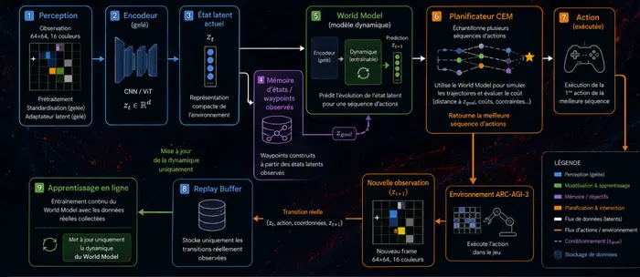

# Ce que mon stage sur ARC-AGI-3 m’a appris sur les World Models

Pendant mon stage chez **SynaLinks**, j’ai travaillé sur un problème assez différent d’un système de vision ou de contrôle classique : construire un agent capable d’interagir avec des jeux **ARC-AGI-3** qu’il n’avait jamais vus auparavant, sans connaître à l’avance leurs règles ni leur objectif.

À chaque étape, l’agent observe une grille, choisit une action, puis découvre ce que cette action provoque. Il doit donc apprendre en même temps **comment l’environnement évolue** et **quels états semblent réellement utiles pour progresser**.

C’est cette seconde difficulté qui a progressivement changé notre manière d’aborder le problème. Au départ, une grande partie du travail portait sur la qualité du World Model et du planner. Au fil des expérimentations, nous avons constaté qu’un autre verrou devenait tout aussi important : même si l’agent sait atteindre une cible, encore faut-il lui donner une cible pertinente.

## 1. Pourquoi ARC-AGI-3 change le problème

ARC-AGI-3 est interactif : il ne s’agit plus seulement d’observer une grille et d’en déduire une transformation. L’agent doit **agir**, observer les conséquences de ses actions et adapter son comportement à un environnement qu’il découvre en cours de route.

Une action peut déplacer un objet, modifier une couleur, déclencher une interaction ou parfois ne produire aucun changement visible. Surtout, la signification de ces événements dépend du jeu. L’agent ne sait donc pas immédiatement quel objet il contrôle, quelles interactions sont importantes ni quel état correspond à une vraie progression.

Cela sépare naturellement le problème en deux questions :

- **modéliser la dynamique** : que va-t-il se passer si j’exécute cette action ?
- **choisir un objectif** : parmi les états possibles, lequel vaut réellement la peine d’être poursuivi ?

La suite de nos expérimentations s’est construite autour de cette séparation.

## 2. Évolution de notre approche

### Est-ce que des heads peuvent aider le World Model ?

Notre première approche consistait à entraîner le World Model avec plusieurs **heads auxiliaires**, chargées de prédire des informations supplémentaires comme la récompense, la progression ou certains changements observés dans l’environnement [1–4].

L’objectif était d’enrichir la représentation latente et d’aider le modèle à mieux comprendre les situations rencontrées.

Dans notre setting, nous avons cependant observé que ces objectifs supplémentaires avaient tendance à **dégrader l’apprentissage du World Model**. Cela peut notamment s’expliquer par la quantité limitée de données disponible sur chaque nouveau jeu ou par une compétition entre les différentes fonctions de coût.

**→ Les heads n’amélioraient donc pas suffisamment le modèle et pouvaient perturber son apprentissage.**

### Peut-on adapter le modèle au jeu pendant la résolution ?

ARC-AGI-3 place l’agent dans des environnements qu’il n’a jamais vus auparavant. Dès le début, nous avons donc considéré qu’un World Model uniquement pré-entraîné ne serait pas suffisant.

L’agent doit pouvoir continuer à apprendre pendant qu’il interagit avec le jeu : il collecte de nouvelles transitions, les utilise pour améliorer son modèle, puis planifie de nouvelles actions à partir de ce qu’il vient d’apprendre.

Nous avons notamment exploré cette idée à travers des approches comme **AdaJEPA**, avec l’objectif de permettre une adaptation rapide à un environnement inconnu [5–8].

**→ L’adaptation pendant la résolution est donc une composante centrale de notre approche.**

### Peut-on fine-tuner directement l’encodeur ?

Une première manière d’adapter le modèle consistait à modifier directement les paramètres de l’encodeur avec les nouvelles observations collectées pendant la résolution.

Cependant, cette approche s’est révélée instable. Avec peu de nouvelles données, le fine-tuning pouvait modifier fortement l’espace latent et donc **déstabiliser les représentations utilisées par le reste du World Model**.

**→ Nous avons donc choisi de ne plus fine-tuner directement l’encodeur.**

### Peut-on figer l’encodeur et utiliser un adaptateur dense ?

Pour conserver un espace latent stable, nous avons gardé l’encodeur **frozen** et ajouté un **adaptateur dense**.

Le pipeline devient alors :

**Observation → Encodeur frozen → Adaptateur dense → World Model**

L’adaptateur est entraîné pendant le préentraînement avec le World Model, puis figé pendant la résolution. Le World Model peut ainsi continuer à apprendre la dynamique du nouveau jeu dans un espace de représentation qui reste stable.

Cette solution limite le nombre de paramètres modifiés pendant l’adaptation et évite que l’espace latent change pendant que le World Model apprend la dynamique du nouvel environnement.

**→ L’adaptation en ligne se concentre sur le World Model, tandis que l’encodeur et l’adaptateur restent stables.**

### Peut-on aussi supprimer les heads pour ne pas perturber le modèle ?

Après avoir stabilisé l’espace latent, nous avons également simplifié l’objectif d’entraînement du World Model.

Les heads auxiliaires ont été retirées afin que le modèle se concentre sur sa tâche principale : **apprendre la dynamique de l’environnement et prédire les conséquences des actions dans l’espace latent**.

On obtient ainsi une architecture plus simple, avec moins d’objectifs susceptibles d’interférer les uns avec les autres.

**→ Nous conservons donc un World Model avec un objectif de dynamique simple, sans heads additionnelles.**

### Comment guider ensuite le planner sans toucher au World Model ?

Une fois le World Model stabilisé, il restait un problème différent : savoir **vers quel état le planner devait essayer de se diriger**.

Plutôt que d’ajouter une nouvelle head ou une nouvelle loss au World Model, nous avons choisi une approche externe reposant sur des **waypoints**.

L’agent mémorise certains états latents réellement observés pendant son exploration. Ces états peuvent ensuite être utilisés comme objectifs intermédiaires par le planner CEM [2, 9].

Le principal intérêt de cette approche est qu’elle **n’affecte pas l’entraînement du World Model**. Le modèle continue uniquement à apprendre la dynamique, tandis que le système de waypoints agit au niveau de la planification.

**→ Les waypoints permettent donc de guider le planner sans modifier ni perturber le World Model.**

### Peut-on mieux sélectionner les waypoints avec DNS ?

Tous les waypoints mémorisés ne sont pas nécessairement aussi intéressants. Certains peuvent être très proches les uns des autres ou conduire l’agent vers des régions déjà largement explorées.

Nous avons donc testé **Dominated Novelty Search (DNS)** comme mécanisme de filtrage [14]. DNS compare les waypoints selon leur intérêt et leur diversité dans l’espace latent, puis conserve les candidats les plus prometteurs avant la sélection de l’objectif suivant.

Cette méthode reste extérieure au World Model : elle intervient uniquement dans la sélection des objectifs et ne modifie ni l’encodeur, ni l’adaptateur, ni la fonction de coût du modèle.

**→ Waypoints + DNS permet de diversifier les objectifs proposés au planner sans perturber l’apprentissage du World Model.**

## 3. L’architecture à laquelle ces essais nous ont conduits

Les différentes expérimentations de la section précédente ont progressivement conduit à une architecture dans laquelle les rôles sont volontairement séparés.

L’observation est projetée dans un **espace latent stable** par un encodeur et un adaptateur gelés. Le **World Model** apprend ensuite uniquement la dynamique du nouvel environnement. À partir de cet état latent, le **planner CEM** simule plusieurs séquences d’actions et choisit celle qui rapproche le mieux l’agent de l’objectif courant.

En parallèle, les transitions réellement observées sont conservées dans un **replay buffer** et servent à l’apprentissage en ligne du modèle dynamique. La mémoire de waypoints fournit quant à elle des objectifs intermédiaires au planner sans modifier la fonction de coût du World Model.

Cette organisation m’a beaucoup rappelé la séparation utilisée en robotique entre **controller** et **supervision**. Le couple *World Model + CEM* répond principalement à la question **« comment atteindre la cible ? »**. Le choix de la cible relève d’un niveau supérieur : **« quelle cible faut-il poursuivre maintenant ? »**.

Cette distinction s’est révélée importante pour interpréter les résultats.

## 4. Le résultat qui nous a fait changer de direction

Une fois le World Model stabilisé, nous avons utilisé une mémoire de **waypoints** pour donner au planner des objectifs intermédiaires issus d’états réellement observés. DNS permettait ensuite de privilégier des candidats plus diversifiés dans l’espace latent.

Cette stratégie améliorait la diversité des objectifs proposés au controller, mais une limite est devenue claire : **un état intéressant dans l’espace latent n’est pas forcément un état utile pour terminer le jeu**.

Autrement dit, le planner pouvait réussir à rapprocher l’agent d’un waypoint sans que cela corresponde à une progression réelle dans la tâche. La difficulté ne venait donc plus uniquement de la capacité à prévoir les conséquences d’une action ou à construire une trajectoire.

Nous avions amélioré la capacité de l’agent à rejoindre un état latent. Le vrai problème apparaissait ailleurs : **rien ne garantissait que cet état soit le bon objectif à poursuivre**.

Un waypoint contient l’information qu’un état a été observé et qu’il peut être différent de ceux déjà explorés. Il ne contient pas nécessairement le sens de cet état : une interaction importante, un objet correctement déplacé, l’ouverture d’un passage ou toute autre modification réellement liée à la résolution du niveau.

C’est ce constat qui nous a amenés à déplacer une partie de l’effort vers la **supervision des objectifs**.

## 5. Donner du sens aux objectifs : supervision, RLM et piste neuro-symbolique

À ce stade, le problème ne concernait plus uniquement le controller. Il devenait surtout un problème de **supervision** : comment proposer au planner un objectif qui corresponde réellement à une progression dans la tâche ?

Pour explorer cette question, nous avons testé une première approche de **supervision RLM** au-dessus du controller, sans modifier l’objectif d’apprentissage du World Model.

Le principe reste volontairement simple : les **transitions réelles** observées par l’agent sont analysées par un LLM afin de proposer un objectif intermédiaire sous la forme d’un **`goal_grid` 64×64**. Ce `goal_grid` est ensuite projeté par l’encodeur et l’adaptateur gelés afin d’obtenir un **`goal_latent`** utilisable par le planner CEM.

Le pipeline devient donc, de manière simplifiée :

**Transitions réelles → analyse LLM → `goal_grid` → `goal_latent` → CEM**

L’idée n’est pas de demander au LLM de remplacer le World Model. Les rôles restent séparés :

- le **World Model** apprend **comment l’environnement évolue** ;
- le **planner CEM** cherche **comment atteindre un objectif** ;
- la **supervision** essaie de déterminer **quel objectif mérite d’être poursuivi**.

Les premiers essais avec cette supervision RLM n’ont pas permis de résoudre les jeux de manière fiable. Ils ont cependant fourni une première manière d’ajouter une couche plus sémantique au-dessus d’un controller qui reste fondé sur la dynamique apprise.

Cette séparation ouvre aussi une piste qui m’a particulièrement intéressé pendant le stage : les approches **neuro-symboliques**. Un World Model est bien adapté pour apprendre à partir des observations et prédire les conséquences des actions. Mais lorsqu’il faut comprendre qu’un objet est une clé, qu’un autre bloque un passage, qu’une interaction vient de modifier une règle ou qu’une séquence d’événements représente un progrès, une représentation plus structurée peut devenir utile.

L’idée serait donc de ne pas opposer apprentissage neuronal et raisonnement symbolique, mais de les faire travailler à des niveaux différents : **apprendre la dynamique avec le modèle neuronal, puis utiliser une couche de supervision plus structurée pour interpréter les situations, formuler des hypothèses et sélectionner des sous-objectifs pertinents**.

## 6. Le lien avec la robotique

C’est aussi ce qui rend ce travail intéressant au-delà d’ARC-AGI-3.

On retrouve en robotique autonome une séparation assez proche entre plusieurs niveaux de décision. Un système peut disposer d’un modèle de son environnement et d’un controller capable de calculer ou d’exécuter une trajectoire, tout en ayant besoin d’un niveau supérieur pour décider **quelle tâche effectuer, quel sous-objectif choisir ou comment réagir lorsqu’une situation nouvelle apparaît**.

Dans notre architecture, le couple **World Model + CEM** joue principalement ce rôle de controller prédictif : il estime les conséquences possibles des actions et cherche une trajectoire vers une cible. La couche de supervision intervient au-dessus pour donner davantage de sens à cette cible.

ARC-AGI-3 reste évidemment un environnement abstrait basé sur des grilles, mais le problème sous-jacent est très proche d’une question centrale en robotique : **comment un agent peut-il apprendre en interaction, construire un modèle du monde, planifier, puis adapter ses objectifs lorsqu’il rencontre une situation qu’il n’avait jamais vue ?**

C’est précisément ce lien entre **World Models, planification, supervision et raisonnement plus structuré** que j’ai trouvé le plus intéressant dans le projet.

## 7. Ce que je retiens de ces expérimentations

Ce travail m’a surtout montré qu’améliorer un agent interactif ne consiste pas uniquement à rendre ses prédictions plus précises ou son planner plus performant.

Dans notre cas, nous avons progressivement séparé trois niveaux complémentaires :

- **modéliser** : apprendre la dynamique de l’environnement ;
- **planifier** : trouver une séquence d’actions permettant d’atteindre une cible ;
- **superviser** : déterminer quelle cible a réellement du sens dans le contexte courant.

Les waypoints et DNS nous ont permis d’explorer la sélection d’objectifs sans perturber le World Model. La piste RLM a ensuite été une première tentative pour ajouter une supervision plus sémantique. Les approches neuro-symboliques constituent une direction naturelle pour aller plus loin en combinant représentation apprise et raisonnement plus structuré.

C’est probablement le point que je retiens le plus de ce stage : **un agent peut apprendre à prédire et à planifier sans pour autant comprendre ce qui mérite d’être poursuivi**. Pour aller vers des systèmes plus autonomes — notamment en robotique — la qualité du controller compte, mais la supervision et la représentation des objectifs comptent tout autant.

---

## Références

### Références principales

[1] D. Ha et J. Schmidhuber, « World Models », 2018. [arXiv:1803.10122](https://arxiv.org/abs/1803.10122).

[2] D. Hafner, T. Lillicrap, I. Fischer, R. Villegas, D. Ha, H. Lee et J. Davidson, « Learning Latent Dynamics for Planning from Pixels », *ICML*, 2019. [arXiv:1811.04551](https://arxiv.org/abs/1811.04551).

[3] D. Hafner, T. Lillicrap, J. Ba et M. Norouzi, « Dream to Control: Learning Behaviors by Latent Imagination », *ICLR*, 2020. [arXiv:1912.01603](https://arxiv.org/abs/1912.01603).

[4] D. Hafner, J. Pasukonis, J. Ba et T. Lillicrap, « Mastering Diverse Domains through World Models », 2023. [arXiv:2301.04104](https://arxiv.org/abs/2301.04104).

[5] Y. LeCun, « A Path Towards Autonomous Machine Intelligence », *OpenReview*, 2022. [Article](https://openreview.net/forum?id=BZ5a1r-kVsf).

[6] R. Balestriero et Y. LeCun, « LeJEPA: Provable and Scalable Self-Supervised Learning Without the Heuristics », 2025. [arXiv:2511.08544](https://arxiv.org/abs/2511.08544).

[7] L. Maes, Q. Le Lidec, D. Scieur, Y. LeCun et R. Balestriero, « LeWorldModel: Stable End-to-End Joint-Embedding Predictive Architecture from Pixels », 2026. [arXiv:2603.19312](https://arxiv.org/abs/2603.19312).

[8] Y. Wang, O. Bounou, Y. LeCun et M. Ren, « AdaJEPA: An Adaptive Latent World Model », 2026. [arXiv:2606.32026](https://arxiv.org/abs/2606.32026).

[9] R. Y. Rubinstein, « The Cross-Entropy Method for Combinatorial and Continuous Optimization », *Methodology and Computing in Applied Probability*, vol. 1, no 2, p. 127–190, 1999. [DOI: 10.1023/A:1010091220143](https://doi.org/10.1023/A:1010091220143).

### Pistes d’exploration étudiées

[10] R. Sekar, O. Rybkin, K. Daniilidis, P. Abbeel, D. Hafner et D. Pathak, « Planning to Explore via Self-Supervised World Models », *ICML*, 2020. [arXiv:2005.05960](https://arxiv.org/abs/2005.05960).

[11] D. Pathak, P. Agrawal, A. A. Efros et T. Darrell, « Curiosity-Driven Exploration by Self-Supervised Prediction », *ICML*, 2017. [arXiv:1705.05363](https://arxiv.org/abs/1705.05363).

[12] Y. Burda, H. Edwards, A. Storkey et O. Klimov, « Exploration by Random Network Distillation », *ICLR*, 2019. [arXiv:1810.12894](https://arxiv.org/abs/1810.12894).

[13] D. Pathak, D. Gandhi et A. Gupta, « Self-Supervised Exploration via Disagreement », *ICML*, 2019. [arXiv:1906.04161](https://arxiv.org/abs/1906.04161).

[14] R. Bahlous-Boldi, M. Faldor, L. Grillotti, H. Janmohamed, L. Coiffard, L. Spector et A. Cully, « Dominated Novelty Search: Rethinking Local Competition in Quality-Diversity », *GECCO*, 2025. [arXiv:2502.00593](https://arxiv.org/abs/2502.00593).